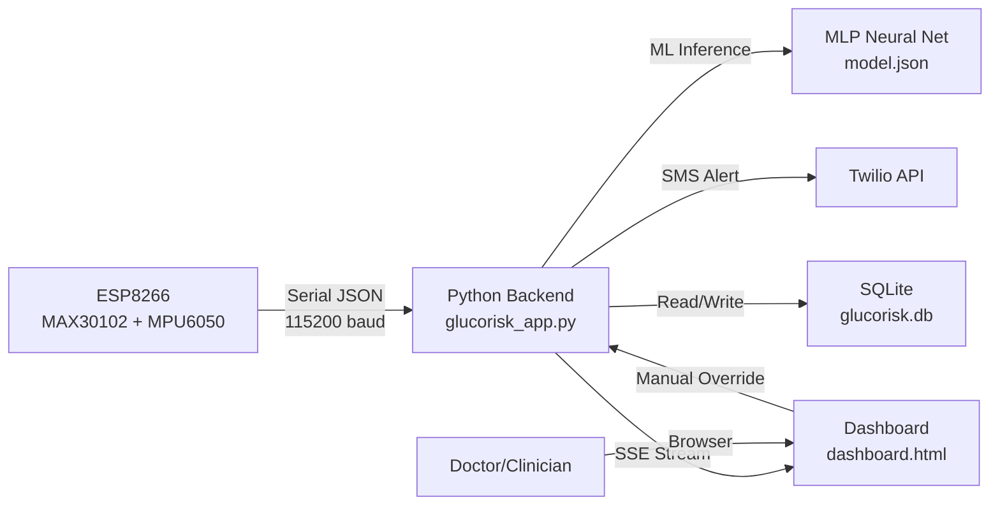

# GlucoRisk — Full Project Analysis Report

## 1. Project Overview

**GlucoRisk** is a real-time medical glucose risk monitoring platform that integrates IoT hardware sensors with a machine learning inference engine and a web-based clinical dashboard.

| Attribute | Value |
|---|---|
| **Language** | Python 3.13 (backend), C++ (ESP8266 firmware), HTML/JS/CSS (frontend) |
| **Framework** | Flask (web server), Chart.js (visualization) |
| **ML Library** | scikit-learn (`MLPClassifier`) |
| **Hardware** | ESP8266 + MAX30102 (HR/SpO2) + MPU6050 (accelerometer) |
| **Alerting** | Twilio SMS API |
| **Database** | SQLite3 |
| **Protocol** | Serial (115200 baud) for hardware, SSE for real-time frontend |

---

## 2. System Architecture



### Data Flow
1. **ESP8266** reads HR, SpO2 (MAX30102) and acceleration (MPU6050) → outputs JSON over serial
2. **Python backend** daemon thread reads serial → stores in `ser_data` dict
3. **SSE generator** checks hardware freshness (5s window) → merges real sensor data with simulated glucose/GSR → runs ML inference → streams JSON payload to browser
4. **Dashboard** receives SSE events → updates 5 live charts + digital twin + risk badge
5. **SMS dispatcher** fires Twilio alert on HIGH_RISK with 5-minute cooldown per session

---

## 3. Machine Learning Model

### 3.1 Algorithm
| Property | Value |
|---|---|
| **Type** | Multi-Layer Perceptron (Neural Network) Classifier |
| **Class** | `sklearn.neural_network.MLPClassifier` |
| **Architecture** | Input(8) → Hidden(16, ReLU) → Hidden(8, ReLU) → Output(4, Softmax) |
| **Optimizer** | Adam (default) |
| **Learning Rate** | 0.001 |
| **Max Iterations** | 1000 |
| **Random State** | 42 (reproducible) |

### 3.2 Input Features (8 total)
| # | Feature | Unit | Range | Source |
|---|---|---|---|---|
| 1 | `glucose` | mg/dL | 30–400 | Simulated |
| 2 | `heart_rate` | BPM | 40–200 | MAX30102 sensor / Simulated |
| 3 | `gsr` | 0–1023 | 0–1023 | Simulated |
| 4 | `spo2` | % | 85–100 | MAX30102 sensor / Simulated |
| 5 | `stress_level` | 1–10 | 1–10 | Derived from GSR/HR |
| 6 | `age` | years | 18–90 | User input |
| 7 | `bmi` | kg/m² | 15–50 | User input |
| 8 | `activity` | 0–3 | 0–3 | MPU6050 sensor / Default 0 |

### 3.3 Output Classes (4)
| Class | Label | Meaning |
|---|---|---|
| 0 | `NORMAL` | All vitals within safe range |
| 1 | `LOW_RISK` | Borderline glucose (75–85 or 140–170 mg/dL) |
| 2 | `MODERATE_RISK` | Glucose drift (60–75 or 170–200 mg/dL), elevated HR |
| 3 | `HIGH_RISK` | Critical glucose (<60 or >200 mg/dL), triggers SMS alert |

### 3.4 Training Data
- **Source**: Synthetically generated with physiological correlations (not real patient data)
- **Size**: 3000 samples, balanced (750 per class)
- **Correlation modeling**: A `stress_base` variable drives correlated variations in HR, GSR, and stress level — mimicking real physiological coupling
- **Preprocessing**: `StandardScaler` normalization (Z-score per feature)
- **Split**: 80% train / 20% test, stratified
- **Exported formats**: `model.json` (Python inference), `model_weights.h` (C header for ESP32 edge inference)

### 3.5 Inference Pipeline
The Python backend performs **local inference** without calling the trained sklearn model directly at runtime. Instead, it:
1. Loads weights/biases from `model.json`
2. Applies Z-score normalization using stored scaler mean/std
3. Forward-propagates through 2 hidden layers with ReLU activation
4. Applies temperature scaling (T=1.5) to raw logits
5. Applies softmax to get class probabilities
6. Returns the argmax class and its confidence score

```python
# Simplified inference flow
x_scaled = (features - scaler_mean) / scaler_std
h1 = relu(x_scaled @ W1 + b1)
h2 = relu(h1 @ W2 + b2)
logits = h2 @ W3 + b3
probs = softmax(logits / temperature)
risk_class = argmax(probs)
```

---

## 4. Hardware Integration

### 4.1 ESP8266 Firmware
- **Board**: ESP8266 (NodeMCU)
- **Sensors**: MAX30102 (I2C — HR + SpO2), MPU6050 (I2C — 3-axis accelerometer)
- **I2C Pins**: SDA=D2, SCL=D1
- **Baud Rate**: 115200
- **Output format**: JSON per line, emitted every 500ms
- **Example**: `{"heart_rate":72,"spo2":97,"accel":1.02,"activity":0,"ir":65432}`

### 4.2 Activity Level Mapping (from accelerometer)
| Accel Magnitude | Level | Label |
|---|---|---|
| < 1.1 g | 0 | Rest |
| 1.1–1.5 g | 1 | Light |
| 1.5–2.0 g | 2 | Moderate |
| ≥ 2.0 g | 3 | Intense |

### 4.3 Auto-Detection Logic
- Python `hardware_loop()` daemon thread polls serial every 100ms
- Auto-detects USB serial ports by scanning for CP210x/CH340/UART descriptors
- Reconnects every 10 seconds if disconnected
- **Freshness window**: If no valid hardware data for 5 seconds → auto-falls back to simulation mode

---

## 5. Web Application

### 5.1 Tech Stack
| Component | Technology |
|---|---|
| Backend | Flask (Python) |
| Frontend | Bootstrap 5 + Chart.js + Custom CSS |
| Database | SQLite3 |
| Auth | Werkzeug password hashing (PBKDF2) |
| Real-time | Server-Sent Events (SSE) |
| Server | Werkzeug `run_simple` with `threaded=True` |

### 5.2 API Endpoints
| Method | Route | Auth | Purpose |
|---|---|---|---|
| GET | `/` | No | Redirects to `/dashboard` or `/login` |
| GET/POST | `/register` | No | User registration |
| GET/POST | `/login` | No | User authentication |
| GET | `/logout` | Yes | Session termination |
| GET/POST | `/dashboard` | Yes | Main clinical dashboard |
| GET | `/stream` | Yes | SSE endpoint for real-time telemetry |
| POST | `/inject_telemetry` | Yes | Manual override (inject custom sensor values) |
| POST | `/administer_treatment` | Yes | Administer dextrose/insulin |
| GET | `/api/status` | Yes | Hardware detection health check |

### 5.3 Database Schema
```sql
-- Users table
CREATE TABLE users (
    id INTEGER PRIMARY KEY,
    username TEXT UNIQUE NOT NULL,
    password TEXT NOT NULL  -- PBKDF2 hashed
);

-- Patient entries
CREATE TABLE entries (
    id INTEGER PRIMARY KEY,
    user_id INTEGER NOT NULL,
    timestamp TEXT NOT NULL,
    glucose REAL, heart_rate REAL, gsr REAL, spo2 REAL,
    stress REAL, age REAL, bmi REAL, activity REAL,
    risk TEXT, score INTEGER,
    FOREIGN KEY (user_id) REFERENCES users(id)
);
```

---

## 6. Dashboard Features

### 6.1 Real-Time Charts (5 total)
| Chart | Color | Data Source |
|---|---|---|
| Glucose (mg/dL) | Cyan `#00f0ff` | Always simulated |
| Heart Rate (BPM) | Red `#ef4444` | MAX30102 or simulated |
| SpO2 (%) | Green `#22c55e` | MAX30102 or simulated |
| GSR (Stress) | Orange `#f97316` | Always simulated |
| ML Risk Score (%) | Purple `#a855f7` | ML inference output |

### 6.2 Other UI Elements
- **Digital Twin**: SVG body diagram with reactive organ highlighting (heart, brain, limbs)
- **Risk Badge**: Color-coded risk classification with confidence percentage
- **Clinical Log**: Auto-logging event feed with timestamps
- **Treatment Buttons**: Dextrose (glucose +20–30) and Insulin (glucose -20–30)
- **Manual Override Modal**: Inject custom sensor values for testing
- **Status Badge**: Dynamically shows "ESP8266 Hardware" / "Simulation Mode" / "Manual Override"

---

## 7. SMS Alert System

| Property | Value |
|---|---|
| **Provider** | Twilio |
| **Trigger** | `HIGH_RISK` classification |
| **Cooldown** | 5 minutes per session (prevents alert fatigue) |
| **Message Format** | Plain ASCII (no emoji — Indian DLT carriers filter unicode) |
| **Credentials** | Loaded from `.env` file |

### Required Environment Variables
```
TWILIO_ACCOUNT_SID=ACxxxxxxxxxx
TWILIO_AUTH_TOKEN=xxxxxxxxxx
TWILIO_FROM_NUMBER=+1xxxxxxxxxx
TWILIO_TO_NUMBER=+91xxxxxxxxxx
FLASK_SECRET_KEY=your-secret-key
```

---

## 8. Security

| Feature | Implementation |
|---|---|
| Password Storage | Werkzeug PBKDF2 hash (`generate_password_hash`) |
| Session Management | Flask session with persistent secret key |
| Route Protection | `@login_required` decorator on all protected routes |
| Credential Security | `.env` file excluded via `.gitignore` |
| Input Validation | Strict numeric validation on form inputs |

---

## 9. Key Interview Q&A

**Q: What ML model is used and why?**
> MLP (Multi-Layer Perceptron) with architecture 8→16→8→4. Chosen because: (1) lightweight enough for edge deployment on ESP32, (2) exportable as C weight arrays, (3) sufficient capacity for 4-class classification with 8 features.

**Q: Why not use a pre-trained model like XGBoost or a CNN?**
> The data is tabular (8 numeric features), not image/sequence data. MLP is appropriate for tabular classification. XGBoost could work but doesn't export cleanly to C for ESP32 edge inference. CNN would be overkill here.

**Q: Is the data real or synthetic?**
> Synthetic, but physiologically correlated. A `stress_base` variable drives coupled variations in HR, GSR, and stress — mimicking how these bio-signals covary in real patients. The model is a proof-of-concept; production use would require IRB-approved clinical datasets (e.g., MIMIC-III, PhysioNet).

**Q: How does hardware/simulation switching work?**
> A daemon thread polls the serial port. Each valid JSON packet updates `last_hardware_time`. The SSE generator checks if `time.time() - last_hardware_time < 5`. If yes → hardware mode (real HR/SpO2). If no → simulation mode. GSR and glucose are always simulated since no physical sensors exist for glucometry in this prototype.

**Q: How is the real-time data streamed to the browser?**
> Server-Sent Events (SSE). The `/stream` endpoint returns a `text/event-stream` response with `Cache-Control: no-cache` and `X-Accel-Buffering: no` headers. The Flask server runs in `threaded=True` mode so SSE connections don't block other HTTP requests.

**Q: How is SMS delivery handled?**
> Twilio REST API via `twilio` Python SDK. Triggered on HIGH_RISK with a 5-minute per-session cooldown. Message body is plain ASCII (no emoji) to avoid DLT carrier filtering in India.

**Q: What is the concurrency model?**
> (1) Main thread: Flask web server (threaded=True for concurrent request handling), (2) Daemon thread: serial port polling (`hardware_loop`), (3) Per-SSE-connection: generator function with isolated per-session state dictionary to prevent cross-user data pollution.

**Q: How can this be improved for production?**
> (1) Replace synthetic data with real clinical datasets, (2) Add HTTPS/TLS, (3) Migrate from SQLite to PostgreSQL, (4) Use Gunicorn/uWSGI instead of werkzeug, (5) Add DLT registration for Indian SMS compliance, (6) Add a physical glucose sensor (CGM integration).

---

## 10. File Structure

```
GlucoRisk_Package/
├── .gitignore
└── GlucoRisk_Package/
    ├── GlucoRisk_ESP32/
    │   └── GlucoRisk_ESP32.ino      # ESP8266 firmware (C++)
    ├── glucorisk_app.py              # Core backend (ML, serial, SSE, SMS)
    ├── web_app.py                    # Flask routes, auth, DB
    ├── train_model.py                # ML training pipeline
    ├── model.json                    # Trained model weights (JSON)
    ├── model_weights.h               # C header for ESP32 edge inference
    ├── glucose_risk_dataset.csv      # 3000-sample training dataset
    ├── glucorisk.db                  # SQLite user/entries DB
    ├── requirements.txt              # Python dependencies
    ├── .env                          # Twilio + Flask secrets (gitignored)
    ├── static/
    │   └── SW.js                     # Service worker
    └── templates/
        ├── base.html                 # Base layout (Bootstrap 5, DM Mono font)
        ├── dashboard.html            # Main clinical dashboard
        ├── login.html                # Login page
        └── register.html             # Registration page
```

---

## 11. Dependencies

| Package | Purpose |
|---|---|
| `flask` | Web framework |
| `werkzeug` | WSGI server, password hashing |
| `numpy` | Numerical computation for ML inference |
| `scikit-learn` | ML model training (`MLPClassifier`) |
| `pyserial` | Serial communication with ESP8266 |
| `rich` | Terminal UI (CLI mode) |
| `twilio` | SMS alert dispatch |
| `python-dotenv` | Load `.env` configuration |
